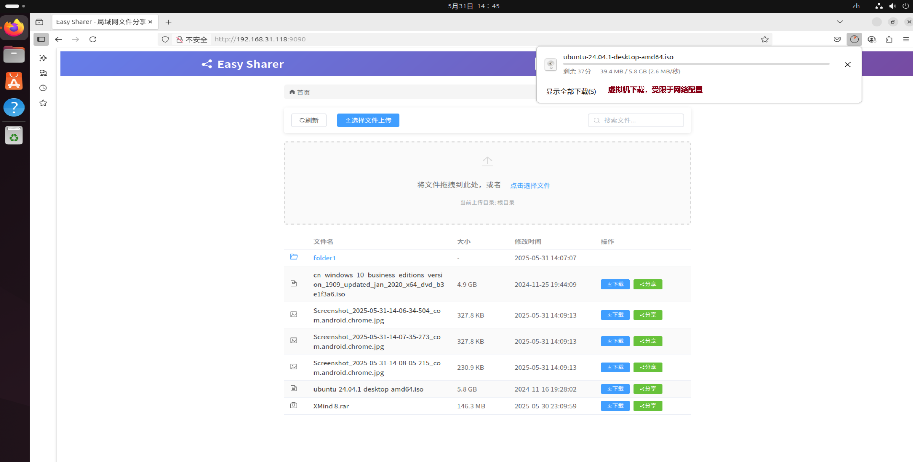

# 项目定位
一款简单的文件分享系统。
# 解决的问题
- 1、局域网内(例如同一WiFi下)不同设备间的文件共享

- 2、使用其他第三方设备时的隐私问题.

- 3、安卓安装包的尾缀被修改导致无法再手机端安装等问题

- 4、文件传输速度慢的问题，本项目的速度限制通常在于网络带宽，而局域网的网络通常是非常快的

- 5、把某一台设备当做文件服务器，用于下载和上传文件

# 主要功能
- 文件浏览
- 文件下载
- 文件上传
- 文件分享链接、二维码生成

# 截图
主界面

手机下载界面，速度极限为路由器的带宽

虚拟机下载，最大速度为虚拟机配置的网络带宽
